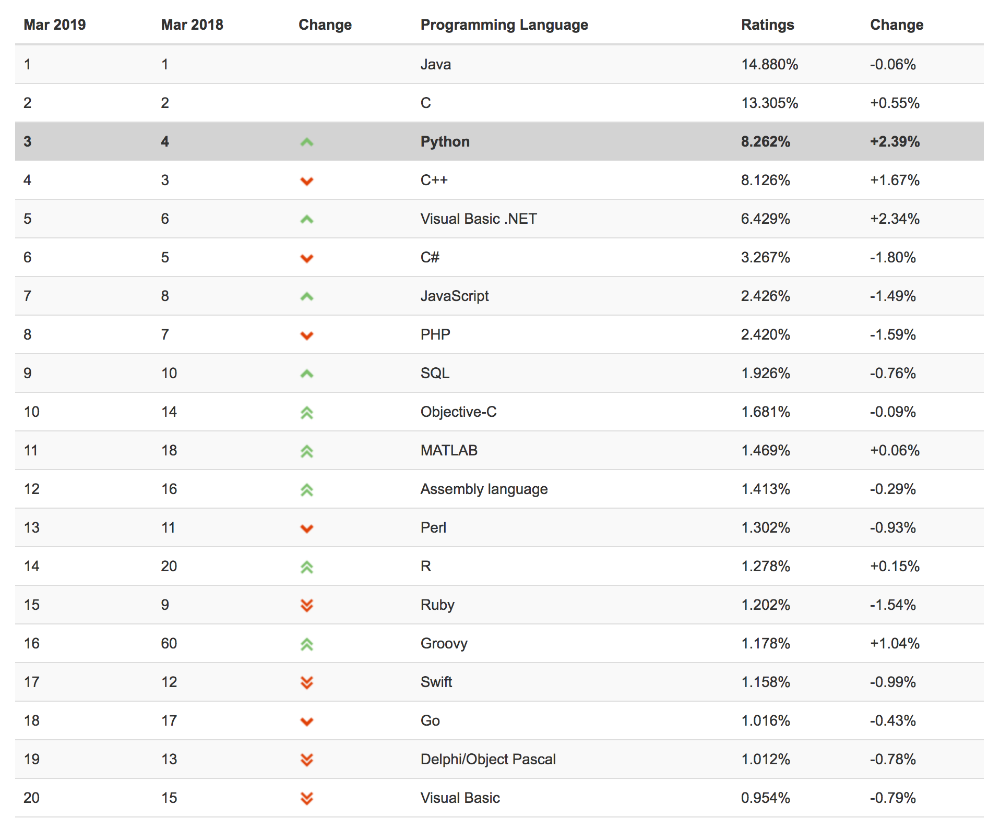

## 提前摘要
> **在正式学习Python之前，需要先来聊几个问题，让大家可以了解计算机行业，方便日后的学习。**       

什么是计算机？
---
>  **我们可以把计算机想象成一个“机器人”，它可以替代人类做一些事情，从而解放人类。**    

>  **但是，默认情况下此“机器人”是冷冰冰什么都不会做的机器，需要有人指挥并告诉它去做这个、干那个…（当然指挥者说的话“机器人”必须听得懂才行）**  

>  **例如：你现在要出门从北京去东莞帮助Alex去探望他女朋友。**

- **原来：买一本地图，在地图上规划出路线（实时性不一定准确）。**
- **现在：电脑或手机上打开地图软件，他会规划处最优路线并且会告诉你天气、路况等信息。**

**其实，这就是计算机根据天气、用户实时汇报的数据帮助你计算出来的结果（相当于“机器人”模拟你已经去了一趟东莞，然后告诉你路况信息）。**

## 什么是程序员/软件工程师？
**大众眼中的程序员**
- 工资高
- 沉默寡言
- 头发少
- 主要工作修电脑（姑娘和程序员约会是其实为了让他修电脑）

**实际中的程序员**

上一个问题中我们把计算机当做是“机器人”，指挥者可以控制它让它代替人类做事。
其实程序员就是这个指挥者，由他来对机器人进行指挥，让他去做各种各样的事，所以到底“机器人”能代替人类做什么事、做多少完全取决于指挥者有多牛逼。

当然，程序员要想控制“机器人”（计算机），一定要先学会他能够听懂的语言，这样才能控制

## 什么是编程语言？
简而言之，计算机能听懂的语言我们称为编程语言。

在计算机发展之初，计算机只能听懂的编程语言只有：汇编语言。之后计算机不断进化能听懂的语言越来越多，现在基本上能听懂600多种。最常见的有：C语言、C++、Java、Python、PHP、JavaScript、C# …

2019年3月份TIOBE语言排行

## 为什么学习编程？
**装逼版**

学习编程成为一名有序程序员，让计算机更加智能化，从而解放全人类。

**现实版**

听说计算机相关行业薪资比较搞。

人工智能、机器学习什么的炒的越来越火，希望可以早日踏上这趟快车。

## 为什么学习Python？
600多种编程语言，为什么偏要学Python呢？
- 语法简洁，适合小白入门。
- 类库强大，是运维自动化、数据分析、机器学习首选编程语言。
- 开发效率高，如：Python简单10行代码实现的功能，用其他语言可能需要100行才能完成。
- 开发效率高，如：Python简单10行代码实现的功能，用其他语言可能需要100行才能完成。
- 行业应用领域广，如：云计算、机器学习、科学运算、自动化运维、爬虫、数据分析、GUI图形化、Web开发。

## 访问量统计
本站总访问量次

